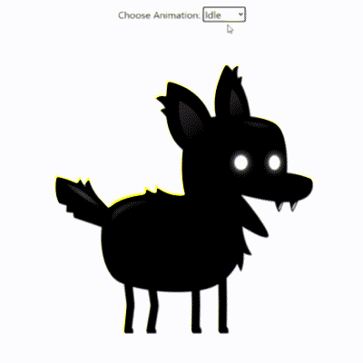

# Sprite Animation With React 

[React Sprite Animation](https://react-sprite-animation.vercel.app/) project created by following the tutorial [Sprite Animation in JavaScript](https://www.youtube.com/watch?v=CY0HE277IBM&list=PLYElE_rzEw_uryBrrzu2E626MY4zoXvx2) from [Franks laboratory](https://www.youtube.com/c/Frankslaboratory/videos).

Following articles were helpful while creating the project:
 - [Animating a Canvas with React Hooks](http://www.petecorey.com/blog/2019/08/19/animating-a-canvas-with-react-hooks/)
 - [HTML 5 Canvas, React Refs and TypeScript](https://hashnode.blainegarrett.com/html-5-canvas-react-refs-and-typescript-ckf4jju8r00eypos1gyisenyf)

Framework and libraries used:

<code></code>
<code></code>
<code></code>
<code></code>

